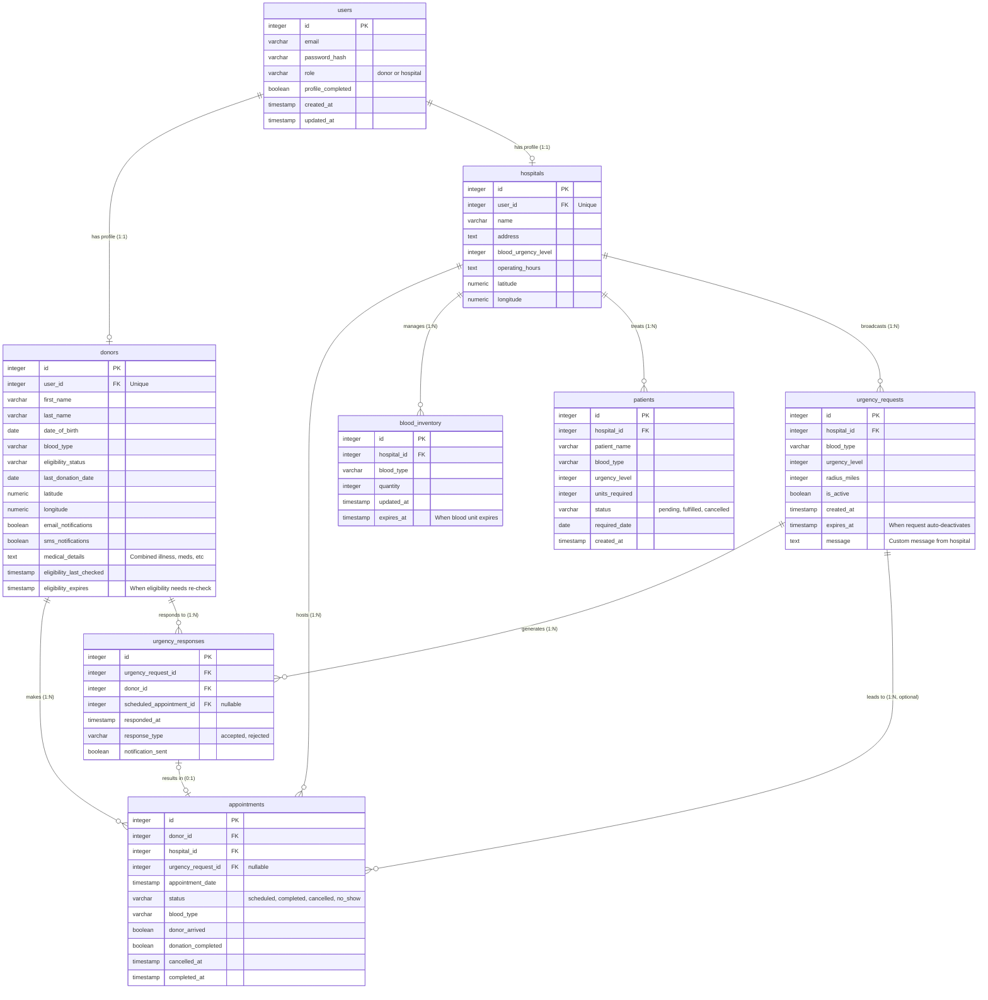

# ForTheGiving – Blood Donation Management System

## Overview
ForTheGiving is a blood-donation management platform designed to help hospitals, donors, and patients stay connected during urgent medical situations. The system centralizes real-time information about hospital inventory levels, patient needs, donor eligibility, and geographic proximity so hospitals can quickly identify shortages and reach eligible donors nearby.

We selected this application because it allowed us to explore relational schema design, foreign-key relationships, ER modeling, real-time communication, and full-stack system integration while working on a realistic healthcare scenario.

---

## Key Features

### Donor Management
Donors can register, submit demographic and health information, and complete an eligibility questionnaire. The system tracks medications, medical history, travel history, tattoos, and donation history to determine donor eligibility.

### Hospital & Inventory Management
Hospitals maintain their own blood inventory and patient records. They can update blood unit counts, track shortages, and manage their local inventory. All hospital accounts are authenticated securely.

### Urgency Requests
Hospitals can create urgency requests specifying:
- Required blood type  
- Urgency level  
- Geographic radius  
- Custom message detailing the situation  

Eligible donors within the radius receive these requests in real time.

### Appointment Scheduling
When donors accept a request, the system automatically links it to an appointment at the hospital. Appointments include status, scheduling details, and the associated urgency request.

### Interactive Donor Map
A Google Maps interface displays donors within a five-mile radius of the hospital.  
Markers are color-coded:
- **Green** – eligible donors  
- **Red** – ineligible donors  
- **Blue** – donors who responded to urgency requests  

Hospitals can click markers to view donor profiles, eligibility, distance, and blood type.

---

## Database Design

The system uses a fully relational schema implemented in Supabase with the following major tables:
- `users`
- `donors`
- `hospitals`
- `patients`
- `blood_inventory`
- `urgency_requests`
- `appointments`
- `eligibility_audit_log`
- `admin_eligibility_overrides`

Most tables follow BCNF or 3NF normalization.  
Every non-key attribute depends fully on its primary key to reduce redundancy and eliminate update anomalies.  
Donor and hospital locations are stored using latitude and longitude to support radius-based filtering.

### Entity-Relationship Diagram

---

## Implementation Details

### Backend (Supabase)
- Database schema and RLS (Row Level Security)
- Real-time subscriptions for urgency requests and appointment updates
- Authentication and role-based access control
- Auto-generated APIs for CRUD operations

### Frontend (React + TypeScript)
- Donor and hospital dashboards
- Eligibility questionnaire workflow
- Real-time updates for urgency requests
- Google Maps integration with distance calculations and filtering

### Mapping & Geolocation
- Converting addresses to coordinates (geocoding)
- Color-coded status markers
- Filtering based on blood type, eligibility, distance, and response history

---

## Challenges & What We Learned

During development, we gained experience with full-stack engineering, database design, real-time APIs, and geolocation systems. Some key challenges included:
- Migrating from MySQL to Supabase for better collaboration and built-in real-time features
- Replacing custom WebSocket logic with Supabase subscriptions for reliable updates
- Handling geocoding accuracy, distance calculations, and API rate limits for maps

We originally planned to implement SMS/email notifications, but due to cost, reliability concerns, and privacy issues, this feature was postponed for future work.

---

## Future Enhancements
- Multi-channel notifications (SMS, email, push)
- Donor reward system or donation streak tracking
- Hospital analytics dashboards
- Predictive modeling for blood shortages based on historical data

---
